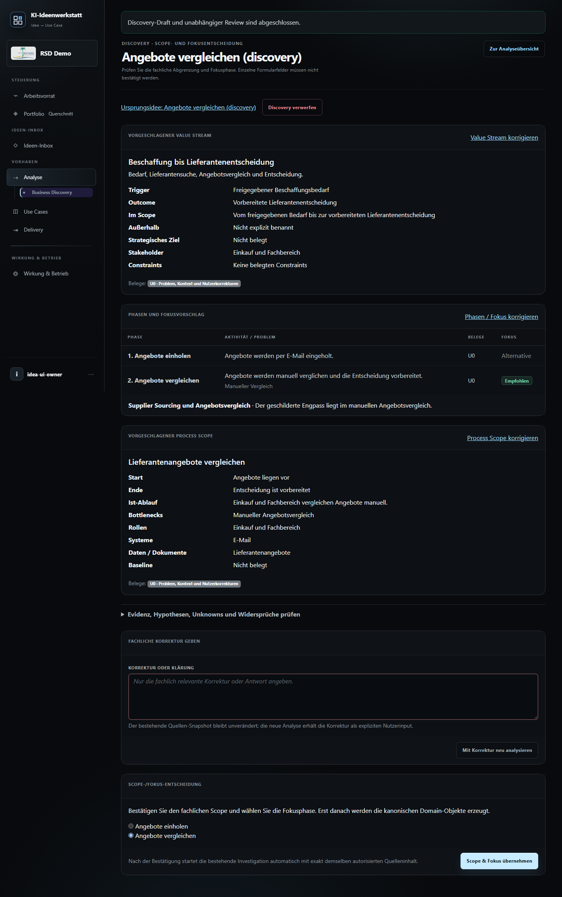
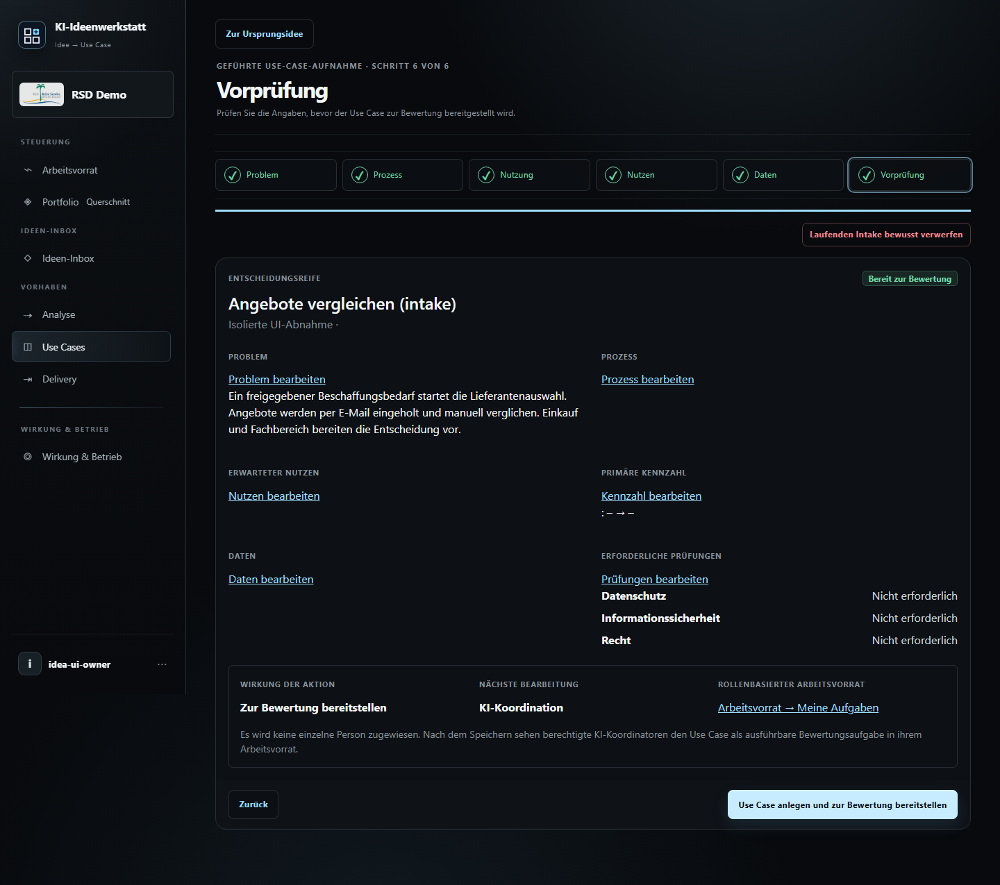

# Desktop UI-/UX-Abnahme: Ideen-Discovery (#124-127)

## Plan

Nur Desktop (Hauptlauf 1440 x 1000, Discovery zusaetzlich 1280 x 900 und
1920 x 1080), entsprechend Nutzerauftrag; keine Tablet-/Mobile-Abnahme.
Eine isolierte temporaere Datenbank und synthetische Quellen verhindern Eingriffe in
produktive Daten. Der Discovery-Provider antwortet deterministisch; die echten Views,
Formulare, Berechtigungen, Snapshots und Materialisierung bleiben aktiv.

1. Idee, Vorbelegung und Discovery-Start ohne Zusatzdatei pruefen.
2. Browser-Zurueck/-Vorwaerts, Fortsetzen und Ursprungskontext pruefen.
3. Korrekturaktionen bei Value Stream, Phasen/Fokus und Process Scope pruefen.
4. Scope bestaetigen, Investigation und Prozessanalyse oeffnen.
5. Discovery verwerfen; direkte Use-Case-Uebernahme mit Vor-/Zuruecknavigation pruefen.
6. Screenshots visuell auf Lesbarkeit, Zuordnung der Aktionen und Ueberlagerungen
   pruefen; Browserfehler und horizontalen Seitenueberlauf ausschliessen.
7. Linke Seitenleiste: genau ein aktiver Hauptbereich; Discovery, Untersuchung und
   Prozessanalyse/Bearbeitung mit zusaetzlicher aktueller Unteransicht pruefen.

Reproduktion: `uv run --with playwright python scripts/idea_discovery_ui_verification.py`.
Nachweise: `artifacts/idea-discovery-ui-verification/`.

## Ergebnis und behobene Befunde

Abnahme am 03.10.2026 mit echtem Chromium-Browser, automatisierten Klicks und
anschliessender visueller Screenshot-Pruefung. Alle folgenden Wege bestanden:

| Bereich | Geprueft | Aktive linke Leiste |
| --- | --- | --- |
| Idee | Bearbeiten, Speichern, Abbrechen, Vorbelegung | Ideen-Inbox |
| Discovery-Start | Ohne Zusatzdatei, Ursprung, Browser zurueck/vorwaerts | Analyse / Business Discovery |
| Discovery-Review | Bereichsbezogene Korrekturlinks, Eingabefeld, Neuanalyse, Evidenz auf-/zuklappen | Analyse / Business Discovery |
| Korrekturfehler | Ueberlaenge serverseitig abweisen, Fehlermeldung und Text erhalten | Analyse / Business Discovery |
| Untersuchung | Scope bestaetigen, Status aktualisieren, Quellen aufklappen, Prozess oeffnen | Analyse / Untersuchung |
| Prozess | Zur Ursprungsidee, Analyse fortsetzen, Bearbeitungsfelder und Abbrechen | Analyse / Prozessanalyse |
| Verwerfen | Discovery mit Zusatzdatei starten, verwerfen, Idee wieder freigeben | Ideen-Inbox |
| Direkter Intake | Owner ausdruecklich auswaehlen, alle sechs Schritte, vor/zurueck, lokale Bearbeiten-Links, Abschluss | Use Cases; danach Ideen-Inbox |

Behoben, ohne neue fachliche Workflows einzufuehren:

- Korrekturaktionen standen nur weit unterhalb des Discovery-Entwurfs. Jetzt
  stehen echte Links direkt neben Value Stream, Phasen/Fokus und Process Scope
  und fuehren zum bestehenden Korrekturfeld; kein direktes Ueberschreiben von KI-Drafts.
- Ungueltige Korrekturen verloren Fehleranzeige und Text. Das gebundene Formular
  bleibt jetzt sichtbar und veraendert weder Revision noch Quellen-Snapshot.
- Abbrechen bei Ideenbearbeitung fuehrte zur Liste. Es fuehrt jetzt zum Detail.
- Discovery-Start, Intake und materialisierte Prozessanalyse erhalten explizite
  Rueckwege zur Ursprungsidee.
- In der Intake-Vorpruefung fehlten lokale Bearbeiten-Links. Sie fuehren jetzt zum
  jeweils passenden vorhandenen Schritt; abgeschlossene Schritte und Vorpruefung
  bleiben nach Ruecknavigation erreichbar.
- Discovery hatte keinen aktiven Hauptbereich in der linken Leiste; Untersuchung
  und Prozessbearbeitung keine durchgaengige lokale Markierung. Diese Positionen
  sind jetzt sichtbar markiert; aktuelle Unteransichten besitzen `aria-current`.
- Die Prozessuebersicht meldete Hintergrundausfuehrung vor Worker-Zuweisung. Sie
  verwendet jetzt die vorhandene serverseitige Aktivitaetsprojektion und zeigt
  einen angeforderten bzw. wartenden Start statt einer bestaetigten Ausfuehrung.

Screenshots zeigen keine verdeckten Texte/Aktionen oder horizontalen Seitenueberlauf.
Der Browser meldete keine JavaScript-Fehler. Der Schlusslauf ist in `report.json`
festgehalten; `before-review.png` und `before-report.json` erhalten den Erstbefund.
Die Erstpruefung wurde beim Intake wegen noch nicht ausdruecklich gewaehltem Owner
unterbrochen (erwartetes Pflichtfeld, kein Produktfehler). Weitere Wiederholungen
korrigierten Testbedienung/Selektoren und eine Windows-Konsolenausgabe; die oben
genannten Produktbefunde wurden separat behoben und erneut geprueft.

### Bildnachweise

[Alle Screenshots und maschinenlesbaren Berichte](../../artifacts/idea-discovery-ui-verification/).

## Regression und Qualitaetspruefung

- Lokaler fokussierter Lauf: **134 bestanden, 1 uebersprungen** (SQLite).
  Der uebersprungene Test benoetigt echte PostgreSQL-Zeilen-/Advisory-Locks.
- Geprueft: Ideen-/Discovery-Vertrag, Intake, Analyse-Navigation, Untersuchungsanzeige.
- Drei zusaetzliche Regressionstests sichern Korrekturfehler, aktuelle Navigation /
  Startanzeige und die direkte Rueckkehr zur Intake-Vorpruefung.
- Ruff-Lint, Formatierung und Diff-Pruefung bestanden.
- Die vollstaendige PostgreSQL-CI inklusive Migrationen, DEMO-E2E, Gesamttests,
  Sicherheits-/Abhaengigkeitschecks, Compose und Docker-Builds wird auf dem
  aktualisierten Stand von PR #128 erneut ausgefuehrt; das Ergebnis steht im PR.
- Erstes CI nach UI-Nachtrag: 2120 bestanden, ein Regressionstest fehlgeschlagen
  (`test_reader_can_open_current_investigation_without_edit_controls`, laufender
  Altdatensatz ohne vollstaendige Budgetfelder). Die reine Lease-/Dispatch-Anzeige
  ist deshalb aus der bestehenden Aktivitaetsprojektion gemeinsam nutzbar gemacht;
  die Prozessseite benoetigt keine Entscheidungs-/Budgetpruefung mehr. Der alte
  Test und die unveraenderte Policy bleiben erhalten; anschliessend erneute Abnahme.
- Nach dieser Korrektur: **70 bestanden, 1 PostgreSQL-Lock-Test uebersprungen**
  (Diagnose-Integration, Untersuchungsaktivitaet und Ideen-Discovery). Der vorher
  fehlgeschlagene Reader-Test ist unveraendert gruen.

## Grenzen

Keine Aussage ueber Live-Providerqualitaet oder laufende Worker: Diese Abnahme prueft
die Desktop-Bedienung, nicht reale KI-Antworten oder Worker-Latenzen.
